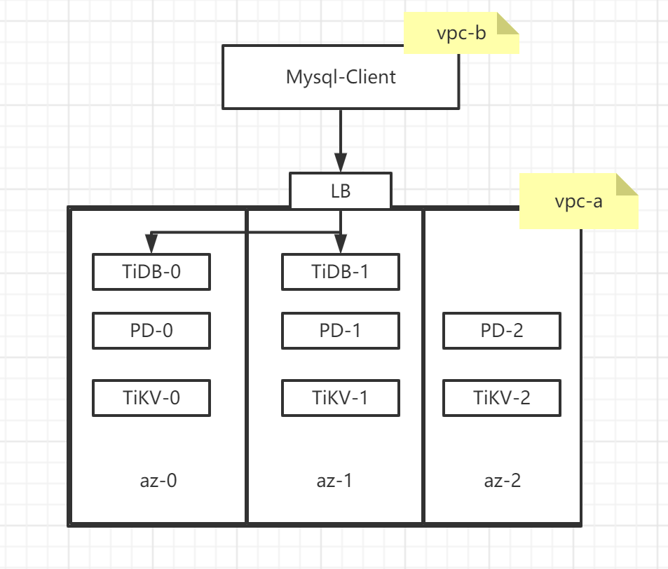
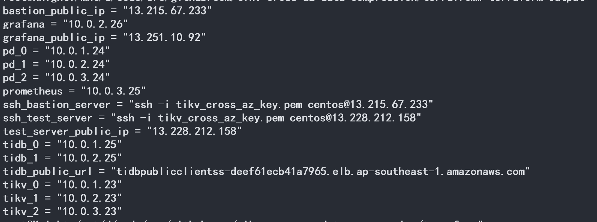

## 部署结构


## 部署步骤
### 部署 aws 云资源
1. terrafrom init   
2. terrafrom apply 
3. terrafrom output

### 输出解释


1. bastion_public_ip: tiup 控制面的公网 ip  
2. grafana_public_ip: tidb 集群 grafana 监控的公网 ip, 登录grafana: http://grafana_public_ip:3000
3. ssh_bastion_server: 如何登录 bastion 
4. ssh_test_server: 如何登录测试机器
5. tidb_public_url: tidb 公网的负载均衡器

## 部署 TiDB 
上一步，terraform 会创建虚拟机出
1. copy tiup/topolgy.yaml 到 bastion vm
2. 部署 tiup: ```curl --proto '=https' --tlsv1.2 -sSf https://tiup-mirrors.pingcap.com/install.sh | sh```
3. 

